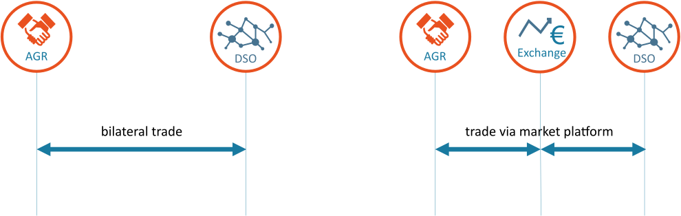
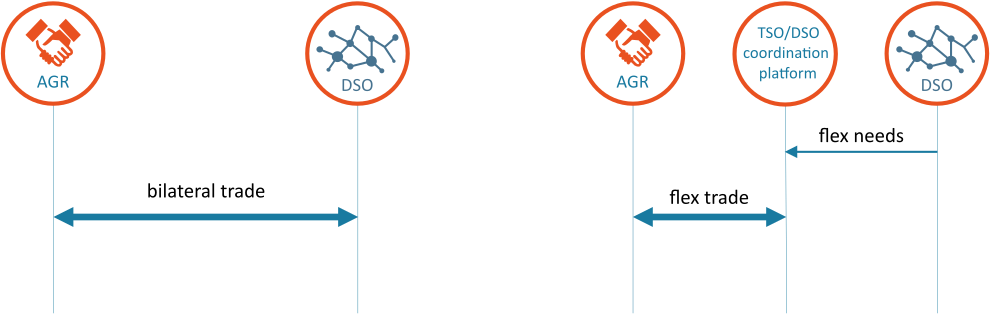

<!--
SPDX-FileCopyrightText: 2020-2023 Contributors to the Shapeshifter project

SPDX-License-Identifier: Apache-2.0
-->

# Scope

## Constraint management services

Constraint management services help grid operators (TSOs and DSOs) to optimize grid operation according to physical and market constraints.
USEF [^B1] distinguishes four different flexibility services within the constraint management category: grid capacity management, congestion management, voltage control and controlled islanding.
UFTP can be used for the first two of these.

[^B1]: USEF, "Flexibility Value Chain (update 2018)," 8 10 2018. [Online]. Available: [https://www.usef.energy/app/uploads/2018/11/USEF-White-paper-Flexibility-Value-Chain-2018-version-1.0_Oct18.pdf](https://www.usef.energy/app/uploads/2018/11/USEF-White-paper-Flexibility-Value-Chain-2018-version-1.0_Oct18.pdf).

### Grid capacity management

Grid capacity management refers to the use of explicit demand-side flexibility (by the DSO or TSO) to increase operational efficiency without impacting freedom of dispatch, trade and connect (copper plate principle).
It is primarily used to defer grid reinforcements, optimize asset operational performance, reduce grid losses, or support planned maintenance.
The implication is that AGRs (and prosumers) participate in the product on a voluntary basis; i.
e.
motivated by appropriate financial incentives.

### Congestion management

Congestion management refers to the use of flexibility to reduce peak loads, in order to avoid system overload and the associated component or system failures.
Contrary to grid capacity management, it will typically limit freedom of dispatch, trade and/or connect.
It is primarily used in unanticipated overload situations; e.
g.
those which could not be forecast during long-term grid planning processes, or where load/ generation increases have outpaced grid reinforcement efforts.
Congestion management is a temporary solution (typically until grid reinforcement takes place) and is a highly-regulated mechanism.
At present, it is only available to TSOs in most European member states although it may be offered to DSOs in the future.

The two mechanisms differ in the freedom of dispatch, trade and/or connect and this is handled via contracts and will have impact on the settlement components.

## Bilateral trading and trading via a market platform

UFTP is designed for bilateral trading between the AGR and DSO.
Trading via market platforms can bring added value, see [^B2].
In UFTP, market platforms may take the role of trading counterparty, hence serving as a DSO proxy in trades with the AGR, and as an AGR proxy in trades with the DSO.
When trading via a platform, the role of FlexRequests from DSOs to AGRs is less obvious; i.e., a DSO has free choice of the available FlexOffers.
In addition, FlexOffers and FlexRequests do not need to be directly related and so UFTP supports unsolicited FlexOffers without requiring a reference to an underlying FlexRequest.

## TSO/DSO coordination

USEF assumes that a DSO or TSO can freely and independently trade flexibility with AGRs.
Any potential goal conflicts can be settled through the market mechanism.
Alternatively, TSO and DSO requests can be aligned, resulting in a TSO/DSO coordination platform where TSOs and DSOs coordinate the tendering, trading, activation and/or settlement of flexibility for their own purposes ( i. e. ancillary services).
See [^B2] for a discussion on this topic.

[^B2]: USEF, "White paper: Flexibility Platforms," 2 november 2018. [Online]. Available: [https://www.usef.energy/app/uploads/2018/11/USEF-White-Paper-Flexibility-Platforms-version-1.0_Nov2018.pdf](https://www.usef.energy/app/uploads/2018/11/USEF-White-Paper-Flexibility-Platforms-version-1.0_Nov2018.pdf).

UFTP can be applied without any further changes in a configuration where there is TSO/DSO coordination.

## Alternative use

The text, graphs and examples in this document assume flex trading between AGR and DSO.
However, UFTP can equally be used for grid constraint services between an AGR and TSO.

The messages defined in UFTP can also be used for flexibility trading in the plan phase between an AGR and BRP.
See the USEF Framework Specifications [^B3] for a complete description of this alternative use.

[^B3]: USEF, "USEF - The FrameWork Specifications 2015," 2015. [Online].
