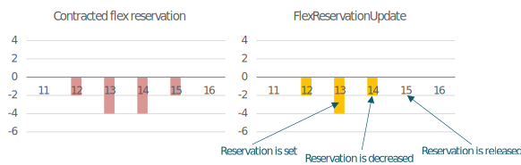
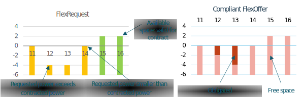

# Flex reservation mechanism

As introduced in [Bilateral contract: FlexOption](../general-description/contract-phase.md#bilateral-contract-flexoption), DSO’s may want to contract a minimum amount of flexibility to be sure that it is available on request.
The FlexOption (not part of UFTP) is a bilateral contract between DSO and AGR to reserve a specified amount of flexibility at a specific location (i.e. congestion point), for a specified time schedule and duration.
In the day-ahead grid planning process, the DSO’s forecast will indicate whether the contracted amount of flexibility is actually needed.
If not, the flexibility can be used for other purposes.
The DSO can send a FlexReservationUpdate message to signal the actual needs to the AGR.
This appendix describes the purpose of this FlexReservationUpdate message and its impact on the contractual obligations and the actual FlexRequest that may follow in the validate phase.

<figure markdown>
  
  <figcaption>Example flex reservation and FlexReservationUpdate, displayed in graphs</figcaption>
</figure>

The figure above illustrates how ISPs 11 to 16 are part of a contract, where the AGR is required to reserve flexibility at ISPs 12 to 15 (downwards power only – for more information on direction and amount of power, see Section [Power](../message-descriptions/message-catalog/power.md)).
The DSO was obliged to send a FlexReservationUpdate before each deadline, confirming the reserved power or partially releasing it.
The power values from the updated reservation should always be equal to, or lower than, the (absolute) values from the original reservation but since the contract is out-of-scope for UFTP, the DSO and AGR should maintain their own agreements about this.

After the FlexReservationUpdate, the AGR is obliged to keep the amount of flexibility available – even if no FlexRequest follows.
After a FlexRequest is published, the AGR is obliged to produce a FlexOffer that meets the contract within the boundaries of the FlexRequest, where only the lowest reserved and requested power is valid for the contract.
This is illustrated in the following figure:

<figure markdown>
  
  <figcaption>Example FlexRequest and requirements of FlexOffer, displayed in graphs</figcaption>
</figure>

For further information on the FlexRequest, see [Flexibility trading between the AGR and DSO](../general-description/validate-phase.md#flexibility-trading-between-the-agr-and-dso).
Both the FlexReservationUpdate and the FlexRequest can only reduce the amount of power that the AGR is obliged to offer, as opposed to increase it.
For ISP 12, the requested power exceeds the power that the AGR had to reserve in advance.
The contract is therefore only valid for the lowest (absolute) power value, being -2.
For ISP 14, the opposite is happening: the reserved power is not requested.
Therefore, the AGR is not obliged to provide flexibility for ISP 14.

For ISP 15 and 16, available space is given for the AGR to deviate in the opposite direction.
**For all ISPs that are included in the contract – even when the reservation is set to 0 – the AGR is obliged to conform to the restrictions given by the FlexRequest, including the bounds of available space.**
The AGR is also free to provide more power than agreed, as long as it contributes to the decrease in congestion.
In this example, the resulting FlexOffer that complies to the contract must be as illustrated in the graph on the right in the figure above.
