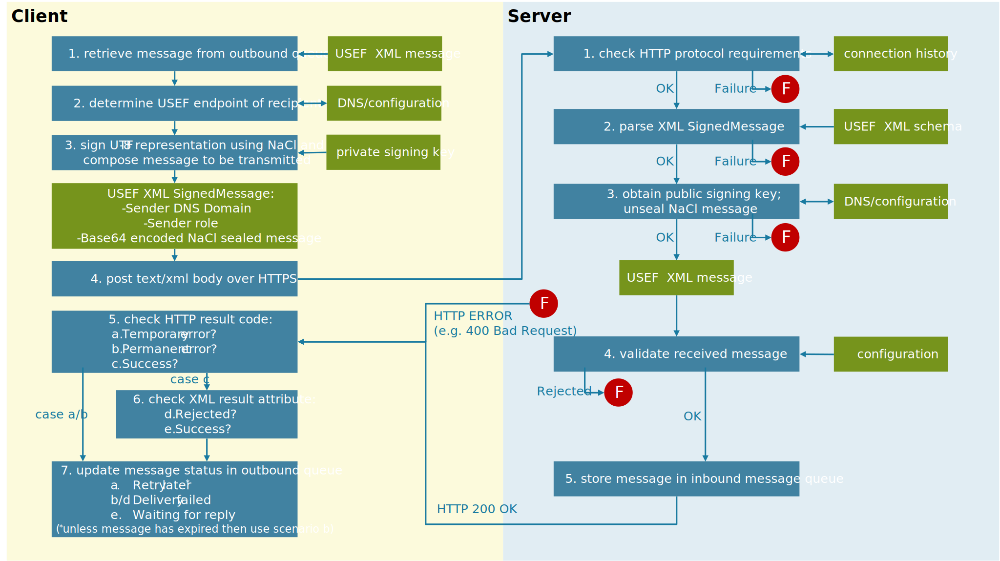

# Message transport mechanism

When implementing the USEF best-practice message transfer mechanism, the procedures outlined in this section apply.

## Cryptographic Scheme (CS)

The USEF privacy and security guidelines require all participants to be able to securely transmit and authenticate messages.
For these purposes, a transport-independent cryptographic scheme is specified, identified as Cryptographic Scheme Type 1 (CS1): implementation is a recommended practice for all implementations[^13].
Based on NaCl[^14], a public domain library with high-speed state-of-the-art security features and a purpose-built and straightforward programming interface[^15], this scheme requires participants to generate two public/private key pairs:

[^13]: If this recommendation is not followed, a compatible implementation should be provided in order to achieve USEF compliance.

[^14]:
    Pronounced “salt” and available with extensive documentation from [http://nacl.cr.yp.to/](http://nacl.cr.yp.to/).
    Sodium, [https://github.com/jedisct1/libsodium](https://github.com/jedisct1/libsodium), is an extended NaCl derivative with Windows, OS X and Linux platform support and many available language bindings.
    Sodium is highly recommended for USEF-compliant implementations.

[^15]: Whereas typical cryptographic libraries require several steps to implement message encryption or signing, with each step opening the door for fatal programming mistakes, NaCl offers simple high-level functions which take care of everything, dramatically reducing the risk of inadvertent implementation errors.

| Purpose                          | NaCl function       | Private key bits | Public key bits |
|----------------------------------|---------------------|------------------|-----------------|
| Digital signatures               | crypto_sign_keypair | 512              | 256             |
| Authenticated message encryption | crypto_box_keypair  | 256              | 256             |

The resulting private keys must be securely stored using an operating system or language-supplied facility for that specific purpose (e.g. the Win32 Data Protection API, OS X Keychain service or JVM KeyStore).
In addition to being stored locally, the public keys are exchanged with other USEF participants.
For that purpose, the keys are joined together in a single 64-byte array (signature key followed by encryption key), Base-64 encoded and prefixed by the constant cs1 and a period (indicating that the version 1 cryptographic scheme is used).
For example: `cs1.V4lZrkYHq8FzneXxUML+QEMXMul3tBm+gPGoVDIZBA92VoWTu8/kRu2Zx72XOm1i/qwwoSgXjqSAqSa43myCaQ==`

This public key string can be published in the DNS zone of the domain used in the associated entity address, or manually exchanged with other USEF participants.
If DNS is used, implementation of DNSSEC is mandatory, as otherwise the key material would be completely untrusted.
Implementations must use a DNSSEC validating resolver, which can either be built-in, or an external resolver on a fully trusted network.

When signing an outgoing message using the private digital signature key and NaCl’s `crypto_sign` function, the result is an opaque blob: the sealed message.
Unsealing this message, using the corresponding public digital signature key and `crypto_sign_open`, performs signature verification and returns the message plaintext.
Since this all happens in the same API call, it is not possible to accidentally process an unsigned or incorrectly signed message.

### Message exchange logic

The entire message exchange, from the client’s outgoing message queue to the server’s incoming message queue, using HTTP-over-TLS transport and the default cryptographic scheme, is visualized in detail in the picture below.

<figure markdown>
  { width=1000px }
  <figcaption>End-to-end USEF message exchange.</figcaption>
</figure>

Messages go through the following stages between retrieval from the client’s outgoing message queue and delivery to the server’s inbound message queue:

## Service discovery

### Versioning

For versioning of the specification we use semantic versioning (see [https://semver.org/](https://semver.org/)).
In short: MAJOR.MINOR.PATCH. Each new major version is incompatible with previous versions; New minor versions are backwards compatible with previous minor versions within the same major version.

### Supporting multiple versions of the protocol

DSO’s should be more flexible than AGR’s, so DSO’s will support multiple versions of the protocol, but only for a restricted time.

Also, the CRO should support multiple versions.

DSO's and CRO are expected to support at most the three latest versions.

### Version coupled to URL

Each major version should have a different url-path, so it is possible to route each incompatible protocol version to another service.
This means that for minor changes and patches the url will remain the same.
The convention for the url-path (by example) is as follows:

version 2.0.0: /shapeshifter/api/v2/message

version 2.1.0: /shapeshifter/api/v2/message

version 3.0.1: /shapeshifter/api/v3/message

### Messages

The metadata of each message contains the specification version.
A rejection reason will be added to reject a message with an invalid version

### Service discovery

In the service discovery stage, DNS[^16] is used to discover the capabilities as well as the endpoint host name and IP address of the remote participant.
Assuming the Internet domain name of the remote participant is example.com, the relevant DNS records are as follows:

[^16]:
    Each USEF participant is responsible for publishing its own endpoint and public key information in a self-managed DNS zone.
    To prevent man-in-the-middle interference with the published information, use of DNSSEC is mandatory for such zones.

|                                  |                                                                                                                                                                                                                                                                                                                                                                                                                                                                                                                                                                                             |
|----------------------------------|---------------------------------------------------------------------------------------------------------------------------------------------------------------------------------------------------------------------------------------------------------------------------------------------------------------------------------------------------------------------------------------------------------------------------------------------------------------------------------------------------------------------------------------------------------------------------------------------|
| _usef.example.com                | TXT record specifying the version of the USEF specification implemented by this participant, e.g. `2015`                                                                                                                                                                                                                                                                                                                                                                                                                                                                                      |
| \__role_._usef.example.com       | TXT record containing up to two[^17] space-separated Base-64 encoded public key strings for the specified role, where role is one of the values `AGR`, `CRO` or `DSO`. This data is only queried if (part of) the outgoing message needs to be encrypted                                                                                                                                                                                                                                                                                                                                              |
| _http.\_*role*._usef.example.com | CNAME record indicating the HTTP endpoint receiving messages for the specified role.</br>This label must not have any resource records of other types (with the exception of the mandatory DNSSEC-related records[^18]) and the alias should resolve to an A or AAAA record[^19].</br>On the endpoint host, the implementation must listen on the well-known IANA-assigned TCP port for HTTP-over-TLS, i.e. 443.</br>The implementation may listen on port 80 as well, but only for purposes such as supporting the HTTP/2 connection upgrade mechanism and never for unencrypted message exchange. |

[^17]: Usually one public key string will be present, but in order to support key rotation without invalidating in-transit messages, the implementation should list both the old and the new key for a short period of time (e.g. 24 hours) after a key has been replaced

[^18]:
    USEF participants must enable DNSSEC and implementations must use a validating resolver, treating verification failures as temporary errors, eligible for retrying later.
    Absent DNSSEC authentication, private key strings must not be relied on, and separate manual secure key exchange is required.

[^19]:
    As per IETF RFC 1034 [^B14], implementations must not fail when presented with CNAME chains or loops.
    Chains should be followed (to an implementation-defined maximum depth) and any loops or errors treated as temporary.

[^B14]: P. Mockapetris, ""Domain names - concepts and facilities", STD 13, RFC 1034," 1987.

The message will remain in the service discovery stage until all required data is available, or a participant-configurable and possibly message-class specific timeout timer expires.
A DNS reply must have the NOERROR status, as well as syntactically valid and DNSSEC-authenticated content, in order to be considered usable.
Other status codes such as SERVFAIL/NXDOMAIN, as well as connection failures or invalid record contents are considered temporary errors, in which case the lookup will be retried later within the timeout period.

To prevent transient Internet connectivity or participant configuration issues from inhibiting message exchange, the timer value used for such a period should be at least one hour for routine messages.
If service discovery fails due to inability to collect all required data within this timeout period, the delivery of the message fails.
Such messages are removed from the outgoing queue and returned to the sending process, indicating a transport error.
Note that, although message queue implementations may inform the sending process about delivery delays, only the final success or failure status is authoritative.
When retrying failed requests, the implementation must implement an exponential back off mechanism to prevent undue load on the remote service.
The implementation should set a reasonable maximum delay interval based on local factors, such as network capacity.

For test situations or small-scale deployments where service discovery via DNS is too cumbersome, or requires unreasonable amounts of additional work, participants should be able to specify service information in a local configuration file.
Since activities on the energy market are most likely regulated by  national oversight bodies, and such organizations are natural candidates for running the authoritative DNS zone for accredited market participants, implementations are encouraged to support a list of DNS suffixes that correspond to the zones maintained by such regulators, and to automatically query these zones.
For example, if an energy.authority.test is on the DNS suffix list, this zone is queried for _usef.example.com.energy.authority.test in order to determine if example.com is an authorized market participant.

<figure markdown>
  { width=1000px }
  <figcaption>Example of the DNS relationships between a single USEF endpoint and multiple zones</figcaption>
</figure>

An example of an anticipated DNS setup is shown above. Here, an incumbent DSO (using the Internet domain `DSO.example`) operates a USEF endpoint, named `SSL.DSO.example`.
The DNS entries for the USEF DSO and CRO role processes that underpin the DSO’s core business both refer to this endpoint, ultimately leading to an IP/port combination usable for submitting USEF messages to.

In order to offer differentiated services to various customer segments, the DSO has also set up various AGRs, each operating its own web site and Internet domain.
One of these AGRs is shown in the diagram.
Instead of operating its own USEF endpoint, this AGR delegates this responsibility to its parent company, by pointing its USEF DNS records at the `SSL.DSO.example` endpoint.

The second AGR shown in the diagram is an independent market participant but lacks sufficient scale to warrant running its own USEF endpoint.
Instead, it outsources that task to the DSO.
Note that, due to the sensitive data included in some USEF messages, strong contractual and technological safeguards (such as full-message encryption) are required to correctly apply the USEF privacy and security guidelines.
Using a single USEF endpoint as shown here has a number of advantages, mostly related to the fact that only a single SSL certificate and IP address are required to operate the endpoint.
Requiring unique instances of these would be complex and expensive, especially if the DSO runs tens or even hundreds of segment-specific AGRs.

There are, of course, disadvantages as well.
Unless network-level measures are taken to prevent this, a single endpoint also means a single point of failure, and shared hosting scenarios that do not ultimately involve only a single legal entity require special attention to the protection of message contents.

## Transmission

Once a valid service endpoint is available, the message enters the transmission stage[^20].
The implementation will now, for a reasonable amount of time (which is again at least one hour for routine messages, employing exponential back off), attempt to deliver the message to the remote participant.

[^20]: For messages containing non-public information, this stage transition may also include encryption of message sections using the public encryption key of the remote participant.

Messages are sent using a HTTP POST operation with the text/xml[^21] content type, the UTF8 character set and content-length indication.
The request URI depends on the USEF implementation level and host name listed in DNS by the recipient.
For USEF 2019 and the host `example.com`, it will be [https://example.com/USEF/2019/SignedMessage](https://example.com/USEF/2019/SignedMessage).

[^21]:
    The USEF specification uses XML, since this format is already widely used in the rather conservative energy market, and enjoys wide and mature tooling support (particularly in the area of schema authoring and validation).
    Unlike other XML-based initiatives (such as WS-*), lightweight implementations are considered key, and alternate serialization formats (such as JSON) should be viable as well, despite being out of scope of this specification.
    If any such alternate message formats are implemented, fallback to XML must be provided as needed, or such implementations will not be USEF-compliant.

Message content consists of a simple wrapper message, specified as SignedMessage in the USEF XML XSD, available for download from the public USEF web site[^22] at [https://usef.info/schema/2019and](https://usef.info/schema/2019and) documented in section [Message catalog](../message-descriptions/message-catalog/index.md).
All usual protocol conventions should be followed during this stage.
For example, when using HTTP version 1.1, redirects (responses with status code 3xx) should be honored in order to support load balancing.
Any server errors (responses with status code 5xx), unknown response status codes,  and connection timeouts and resets should be considered temporary failures and delivery should be re-attempted later within the timeout period.
Only client success or failure messages (responses with status code 200 or a non-ambiguous[^23] 4xx status code, respectively) should be considered final.
This is standard HTTP 1.1 behavior, as fully described in IETF RFC 2616 [^B7].

[^B7]: Fielding, R., Gettys, J., Mogul, J., Frystyk, H., Masinter, L., Leach, P., and T. Berners-Lee, ""Hypertext Transfer Protocol -- HTTP/1.1", RFC 2616," 1999.

[^22]: Please note that USEF makes no warranties whatsoever as to the uninterrupted availability of its web site, and that production services should not rely on the schema being hosted at this location for purposes such as validation: a local copy should be used instead.

[^23]: The prime example of an ambiguous HTTP status code is 404 Not Found: since this is commonly returned by front-end servers in case of temporary back-end issues, USEF implementations are encouraged to consider this a temporary error.:

## Error handling

In the transmission stage, the guidelines for error handling are as follows:

Until the point that the message has been successfully validated against the USEF XML schema, errors are communicated using transport protocol mechanisms, e.g. HTTP status codes.
For the HTTP protocol, the following error conditions are common (note that, depending on the server and libraries used, some of these may be handled automatically):

| Condition                                                                                                             | Status code                | Error type                                                                                                                                                              |
|-----------------------------------------------------------------------------------------------------------------------|----------------------------|-------------------------------------------------------------------------------------------------------------------------------------------------------------------------|
| Missing Content-Length header                                                                                         | 411 Length Required        | Permanent (E cannot be resolved without changes to the sending implementation)                                                                                          |
| Invalid Content-Type header (not text/xml) or character set (default: utf-8)                                          | 400 Bad Request            | Permanent                                                                                                                                                               |
| Originating IP address is sending messages at a rate exceeding receiver policy                                        | 429 Too Many Requests      | Temporary                                                                                                                                                               |
| Body XML cannot be parsed or is not compliant with USEF XML schema                                                    | 400 Bad Request            | Permanent                                                                                                                                                               |
| Failed to look up the sender’s public signature key in DNS                                                            | 419 Authentication Timeout | Temporary (message can be processed when DNS is corrected/replicated)                                                                                                   |
| Invalid signature (inner XML message cannot be unsealed, for example due to NaCl’s crypto_sign_open function failing) | 401 Unauthorized           | Permanent (since no authorization schemes that would allow the request to be resubmitted are available, unless private arrangements between sender and recipient exist) |
| Unsealed body XML cannot be parsed or is not compliant with the USEF XML schema                                       | 400 Bad Request            | Permanent                                                                                                                                                               |

Once a message has been determined to be valid USEF XML, errors are reported using a USEF XML response message with a successful transport disposition (e.g. HTTP status code 200 OK). Possible results in this stage are:

As in the service discovery stage, messages for which transmission permanently fails are removed from the outgoing queue and returned to the sending process, indicating a transport error.

### Common Message Metadata

The USEF XML message obtained after successfully verifying the signature will have a root node corresponding to its message type, which must contain Metadata attributes common to all messages used by the implementation to process the message.
The metadata attributes are defined in [metadata attributes](../message-descriptions/message-catalog/metadata-attributes.md).

## Awaiting reply

If message transmission succeeds, the implementation starts waiting for a reply from the remote service.
Although replies to some messages can be expected immediately, other USEF messages may only elicit a response several hours later.
In any case, responses are always decoupled from requests and implementations should be strictly asynchronous, correlating requests and responses using their conversation identifier.

Because of the asynchronous nature of message exchange, a process needs to be in place for handling messages that do not receive a (timely) reply.
When preparing a new message, the implementation should specify the message class, as well as the time period within which a reply is expected.
The following message classes are defined:

Incoming replies are validated using the steps outlined in the transmission stage.
Where a reply is rejected, the pending outgoing message remains in the awaiting reply stage until it expires, and any additional manual processing is completed.
Messages for which, ultimately, no reply is received are returned to the sending process, indicating expiry.

## Service process message error handling

Since the message exchange process is responsible for transparently handling most, if not all, transient error conditions, service processes have no need for routine error recovery.
In fact, any transport errors reported to the service layer are of such a severe nature that they most likely cannot be corrected without implementation or configuration changes:

- Malformed messages
- Entity address or signing key misconfigurationsExpired message, despite following manual recovery procedures for non-routine messages (for routine messages, no recovery is required by design but logging may definitely be appropriate)

The suggested error handling strategy for service processes is to mark the affected remote participant (i.e. not try to exchange any future messages with it) and to emit a diagnostic message indicating that manual intervention is required.
After the issue is investigated and resolved, the configuration can be manually updated to re-enable the participant.

## EA1 addressing scheme

In USEF messages, there is often a requirement for a globally unique identity for certain entities.
To meet this requirement, USEF defines the Entity Address (EA).
Each EA consists of a prefix, indicating the addressing scheme, followed by the actual address.
Currently, two addressing schemes are supported:

- The European Article Number (EAN), commonly used to uniquely identify connection points in the electricity network and therefore a natural identifier to do the same in USEF.
An example of an EA using this scheme is: ean.871685900012636543
- The USEF type 1 entity address (EA1) is designed to allow participants to generate unique identifiers for themselves and entities managed by them, without relying on a central authority.

The USEF type 1 EA is structured analogous to the iSCSI IQN.
Paraphrasing IETF RFCs 3720 and 3271 [^B8]: the EA does not define any new naming authorities but uses Internet domain names to ensure global uniqueness.
Furthermore, the EA is constructed to give an organizational naming authority the flexibility to further subdivide the responsibility for name creation to subordinate naming authorities.

[^B8]: Bakke, M., Hafner, J., Hufferd, J., Voruganti, K., and M. Krueger, ""Internet Small Computer Systems Interface (iSCSI) Naming and Discovery", RFC 3721," 2004.

This makes the EA format slightly unwieldy but since bandwidth and storage space are not expected to be significant constraints in any USEF implementation, this is considered to be an acceptable tradeoff for not requiring a central authority.
Syntactically, an EA is a variable-length, 7-bit printable ASCII text string containing up to 255 characters.
For example:

```
ea1.2013-11.info.usef.test:001:002.090807002a&b#
    <- naming authority -> < unique identifier >
```

Mostly taken from IETF RFC 3720 [^B9], below are the semantics of the various parts of this EA:

[^B9]: Satran, J., Meth, K., Sapuntzakis, C., Chadalapaka, M., and E. Zeidner, ""Internet Small Computer Systems Interface (iSCSI)", RFC 3720," 2004.

|                           |                                                                                                                                                                                                                                                                                                                                                                                                                                                                                           |
|---------------------------|-------------------------------------------------------------------------------------------------------------------------------------------------------------------------------------------------------------------------------------------------------------------------------------------------------------------------------------------------------------------------------------------------------------------------------------------------------------------------------------------|
| **ea1**                   | Constant, indicating this is a type 1 USEF entity address                                                                                                                                                                                                                                                                                                                                                                                                                                 |
| **2013-11**               | A date code, in yyyy-mm format.  This date must be a date during which the naming authority owned the domain name used in this format, and should be the first month in which the domain name was owned by this naming authority at 00:01 GMT of the first day of the month.  This date code uses the Gregorian calendar.  All four digits in the year must be present.  Both digits of the month must be present, with January == "01" and December == "12".  The dash must be included. |
| **info.usef.test**        | The reversed domain name of the naming authority (person or organization) creating this entity address                                                                                                                                                                                                                                                                                                                                                                                    |
| **001:002.090807002a&b#** | A locally unique string, which may contain product types, serial numbers, host identifiers, or software keys (specifically: it may include colons to separate organization boundaries).  With the exception of the colon prefix, the owner of the domain name can assign everything after the reversed domain name as desired. It is the responsibility of the entity that is the naming authority to ensure that the names it assigns are worldwide unique.                              |
