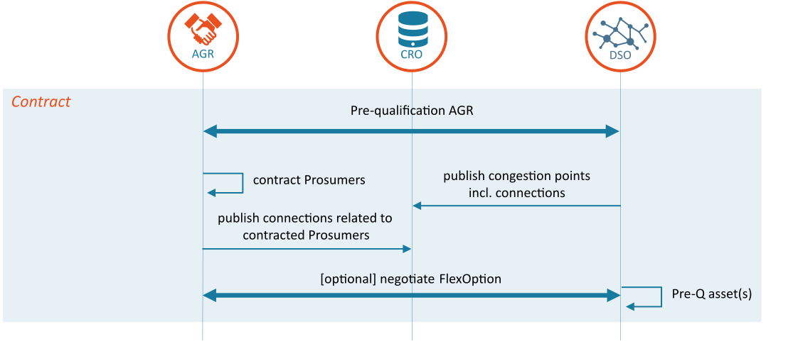

<!--
SPDX-FileCopyrightText: 2020-2023 Contributors to the Shapeshifter project

SPDX-License-Identifier: Apache-2.0
-->

# Contract phase

## Overall description

The contract phase is when DSOs and AGRs begin interaction.
Typically, this involves a pre-qualification process, where the AGRs capability to deliver flexibility, portfolio and IT systems are assessed.
AGR pre-qualification is out-of-scope for UFTP and therefore not further described in this document.
See [^B6] for more information.
In addition, the contract phase includes the exchange of information related to congestion points and associated connections through the common reference.
Note that any contract negotiations for bilateral contracts also takes place in the contract phase (see below).

[^B6]: USEF, "Recommended practices and key considerations for a regulatory framework and market design on explicit Demand Response," 2017. [Online]. Available: [https://www.usef.energy/app/uploads/2017/09/Recommended-practices-for-DR-market-design-2.pdf](https://www.usef.energy/app/uploads/2017/09/Recommended-practices-for-DR-market-design-2.pdf).

<figure markdown>
  { width=1000px }
  <figcaption>General information flow in the Contract phase</figcaption>
</figure>

As part of its internal grid planning process, a DSO determines where congestion may possibly take place.
Congestion points are declared whenever necessary, most likely several times a year, depending on the volume of trend analyses performed by a DSO and the condition of the grid.
By publishing a particular congestion point, the DSO opens a flexibility market for it.
AGRs publish the customers that they serve in the common reference.
As a result, a DSO can determine whether there is liquidity on its market and AGRs know which of their customers can participate in a DSO’s market.

USEF introduces two alternative options for the DSO to procure flexibility from AGRs:

- **Long-term flexibility options:** activation of flexibility options in prearranged bilateral contracts.
Contracts of this nature oblige the AGR to offer a fixed amount of flexibility to the market via daily FlexOffers.
This product guarantees a certain regular availability of flexibility but the price (model) has to be arranged in advance.
As a result, the DSO can select the contract(s) that provide the required flexibility at the lowest costs although these, typically, will not reflect all flexibility available in the market or the actual marginal costs for any flexibility supplied.
This method is comparable to the way in which national TSOs contract balancing services and a tender or auction procedure can be implemented to manage it, alongside long-term flexibility options subject to prearranged specific conditions; e.g. which include a maximum or fixed price for the activation of the flexibility.

- **Short-term flexibility options:** procuring flexibility that AGRs have offered for a specific day.
In this situation, the AGR has no contractual obligation to offer the flexibility to the market but decides to do so on a day-to-day basis.
This product inherently deals with short-term flexibility which is only valid for a specific day.
The price offered by AGRs will better reflect the marginal costs although the availability of the flexibility in this product is not guaranteed.
This method is comparable with the way market parties are free to offer capacity to the TSO on the secondary and tertiary markets (regulating and reserve power) on a daily basis.

The first option seems attractive for the DSO as it guarantees a minimum supply of flexibility, therefore reducing availability risks in the validate phase, but this comes at a higher price.
The DSO is responsible for finding the right balance between costs and certainty, while ensuring that grid reliability is always maintained.
It is important to note that both products are part of the same flexibility market and therefore it provides natural growth options for the evolution of flexibility trading.
While, initially, the availability of flexibility supply and demand might be a primary concern for both buyers and sellers, leading them to focus on long-term contracts, this will likely change as the market matures and availability becomes less of an issue.
At that point, both buyers and sellers would be willing to have greater reliance on short-term flexibility which, in turn, would offer increased market liquidity.

## Bilateral contract: FlexOption

For long-term flexibility, USEF introduces the **FlexOption**. This type of contract enables the DSO to take an option on future flexibility. In relation to this, USEF specifies that:

- a FlexOption is a bilateral contract between DSO and AGR to deliver a specified amount of flexibility, at a specific location (i.e. congestion point), for a specified time schedule and duration.
- FlexOptions force the AGR to send flexibility offers when the flexibility requests match the contract details.
- FlexOptions are tradable via secondary markets.

!!! success "Recommended practice:"

    In order to make FlexOptions attractive to AGRs, a DSO could add remuneration components; e.g. availability remuneration and/or a minimum number of activations.

A FlexOption contract typically has the following ingredients:

| Element                       | Description                                                                                                          | Example(s)                                                                                                                  |
|-------------------------------|----------------------------------------------------------------------------------------------------------------------|-----------------------------------------------------------------------------------------------------------------------------|
| ISPs and durations            | The Imbalance Settlement Period (ISP) in which the flexibility should be delivered and the duration of the contract. | <ul><li>Every ISP between 17:00 and 19:00 on Fridays</li><li>from December through March for the coming two years</li></ul> |
| Lead time                     | Time before the (recurring) flexibility option expires.                                                              | <ul><li>One week before dispatch</li><li>The day before dispatch at 16:00</li><li>Does not expire</li></ul>                 |
| Congestion Point              | DSO-specific: Congestion Point at which the flexibility should be realized.                                          |                                                                                                                             |
| Amount                        | Amount of flexibility being offered, specified as a delta to a baseline value or drop to mechanism.                  | <ul><li>10kW (average power per ISP)</li></ul>                                                                              |
| Capacity remuneration         | Price the AGR receives for offering the flexibility option                                                           | <ul><li>€20/MW/day</li><li>€40/MW/ISP</li></ul>                                                                             |
| Volume remuneration           | Maximum or predefined price for the flexibility, to be paid when the flexibility is ordered by the DSO.              | <ul><li>€20/MWh</li><li>Less than €20/MWh</li><li>€0</li></ul>                                                              |
| Maximum number of activations | The Maximum number of activations at which the flexibility in the LT contract can be called upon.                    | <ul><li>Once per contract</li><li>Once per month</li><li>Unlimited</li></ul>                                                |
| Recovery Time                 | Minimum time between activiations                                                                                    |                                                                                                                             |
| Penalties                     | Amount the AGR is penalized for not offering the option of flexibility and/or the flexibility itself.                | n/a                                                                                                                         |

UFTP does not include messages to communicate the contents of a FlexOption; this is assumed to be out-of-scope.

## Common Reference

A DSO declares its congestion points in the contract phase.
An AGR must be able to retrieve information about these points since this allows it to fulfil its obligation to provide the compulsory D-prognoses to DSOs for congestion points at which it represents customers.
It also aids the AGRs portfolio optimization activities.

Since a prosumer can switch AGRs, and the congestion points in the grid change over time, USEF introduces a ‘common reference’.
The common reference contains a list of connection identifiers (for example EANs) for each congestion point, as registered by the participating DSOs.
Each AGR also registers the connections on which it represents prosumers.
The common reference is shared between all involved parties, while respecting privacy and security principles [^B5] which ensures, amongst other things, that only necessary information is shared and therefore included in the common reference.
The common reference is operated by the Common Reference Operator (CRO) role.
Conceptually, it contains the entities and relationships shown in the figure below:

[^B5]: USEF Foundation, "USEF: The Privacy and Security Guideline," USEF Foundation, Arnhem, 2015. Available: [https://www.usef.energy/app/uploads/2016/12/USEF_PrivacySecurityGuideline_3nov15.pdf](https://www.usef.energy/app/uploads/2016/12/USEF_PrivacySecurityGuideline_3nov15.pdf)

<figure markdown>
  { width=1000px }
  <figcaption>Logical structure of the Common Reference</figcaption>
</figure>

The common reference is, typically, setup by the DSO and includes all of its congestion points.
However, it could be extended to form a common reference at national or European grid level.

UFTP allows for the registering and tracking of changes in the common reference; e.g. a DSO might announce a new congestion point for the following week which is registered in the common reference.
The history of all changes to the common reference is retained and can be retrieved for a certain date using the query function functions (see [AGRPortfolioQuery](../message-descriptions/message-catalog/agr-portfolio-query.md) and [DSOPortfolioUpdate](../message-descriptions/message-catalog/dso-portfolio-update.md)); this will also help resolve any potential disputes.

### Accessibility of the data in the common reference

Access to the common reference data is limited according to the legal or contractual requirements of the various parties consulting it[^3].
This implies that a DSO can only see the data for the connections it is responsible for.
Consequently, it can see which AGRs are serving its connections, in order to ensure that it receives D-prognoses from them.

AGRs can only see information about the congestion points for which they serve connections.
In addition, they can retrieve the number of connections per congestion point.
Implementing the common reference this way ensures that the DSO does not need to share details of its grid topology.

The common reference can be operated in two modes: open mode and closed mode.
If operating in open mode, the CRO will accept updates from any USEF-compliant participants.
In closed mode, participants will need to be pre-configured in order for updates to be accepted.

[^3]:
    Another option is to treat the common reference as open data, therefore implying that everyone can access it.
    Although the open data model can ease the implementation of the common reference, the acceptance of such a model by prosumers is highly dependent on the culture in the geographical area in which the model is used.
