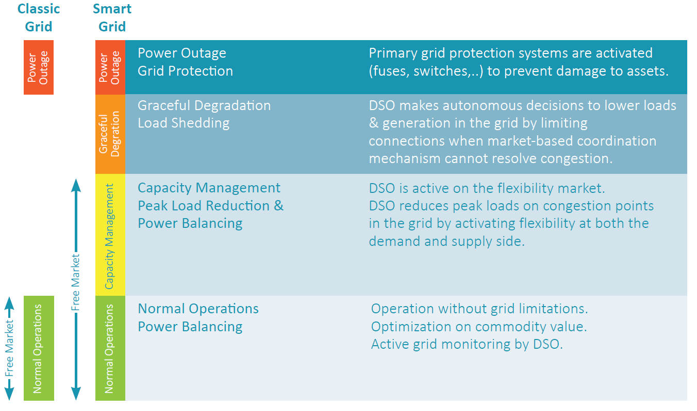

<!--
SPDX-FileCopyrightText: 2020-2023 Contributors to the Shapeshifter project

SPDX-License-Identifier: Apache-2.0
-->

# USEF general concepts

## USEF market-based coordination mechanism (MCM)

USEF’s MCM facilitates the delivery of value propositions (i.e. marketable services) to various market parties without imposing
limitations on the diversity and customization of the propositions.
The USEF MCM is designed for all energy commodities and enables the market to optimize in time, capacity and power.
The MCM provides access, under equal conditions, for all stakeholders to a single integrated market.
This unique approach aims to deliver a future-proof market design. The USEF MCM operations scheme distinguishes five phases:

In UFTP, the general MCM phases are followed. However, processes in each phase are limited to the interactions between the
AGR and DSO for flexibility trading. This includes interaction with the ‘Common Reference’:

- **Contract:** AGR and DSO negotiate FlexOptions.
This is flexibility that is reserved for DSO purposes and can be invoked by the DSO when needed.
Typically, a contract includes availability remunerations and activation remunerations.

- **Plan:** information exchange between DSO and AGRs related to congestion points.
This information exchange through the ‘Common Reference’ involves communication with the Common Reference Operator (CRO).
The AGR carries out an initial portfolio optimization.

- **Validate:** the DSO uses D-prognoses to validate whether the demand and supply of energy can be distributed safely without any limitations.
If congestion occurs, the DSO can procure flexibility from AGRs to resolve grid capacity issues.

- **Operate:** in the operate phase, the actual assets and appliances are dispatched and the AGR adheres to its D-prognoses.
When required, DSOs can invoke additional flexibility from AGRs to resolve unexpected congestion.

- **Settle:** in the settle phase, the flexibility that the AGR has sold to DSOs is settled.
For this purpose, the actual consumed and produced volumes are allocated to the responsible parties first.
Any unresolved or disputed volumes are reconciled shortly afterwards.

## USEF Operating regimes

USEF recognizes four different operating regimes.
The green regime is the classical grid without any limitations (copper plate) and the red regime is where power outages occur.
USEF introduces two additional regimes. In the green and yellow regimes, the MCM assures optimal use of the flexibility available for BRPs (green and yellow) and DSOs (yellow).
The orange regime is introduced as a fallback for situations where there is insufficient flexibility available for the DSO to avoid an outage—the DSO can limit connections to temporarily overrule the market.

<figure markdown>
  
  <figcaption>USEF Operating regimes</figcaption>
</figure>

UFTP flexibility trading takes place solely in the yellow regime. Full descriptions of all other regimes can be found in [^B3].

[^B3]: USEF, "USEF - The FrameWork Specifications 2015," 2015. [Online].

## Day-head and intraday flexiblity trading

The plan and validate phases aim to make optimal use of flexibility and maximize the freedom of dispatch and transactions of all stakeholders before the actual delivery of energy takes place.
The timescale of these phases already ranges from years and months ahead, towards one day ahead and, ultimately, hours ahead before the actual delivery of energy (i.e. the operate phase) starts.
This broad time window supports trading on various energy markets (i.e. forward market, day-ahead spot market and intraday spot-market) and the monitoring of changes in the required grid capacity.

USEF specifies that iterations between the plan and validate phases take place at least twice: initially, during the day ahead and, secondly, during intraday.
Hence, two points in time are determined when the markets close: 1) end of day-ahead 2) end of intraday.
This specification eases the iterative process of creating, aligning and converging plans and D-prognoses and fits well with many current national processes applied in the day ahead and intraday trading market.
Please find more details in [Iterations between the plan and validate phases](validate-phase.md#iterations-between-the-plan-and-validate-phases).

UFTP supports both day-ahead and intraday trading. Intraday trading is optional for UFTP.

## Congestions points

A congestion point is a set of connections which (directly) relate to a part of the grid where grid capacity might be exceeded because it may be insufficient to distribute the requested amount of energy; e.g. the secondary side of an LV transformer.
Please note that a congestion point is a part of the grid where congestion may possibly occur, rather than actually occurs.
It is the DSOs responsibility to determine congestion points.

!!! success "Recommended practice:"

    How to determine which grid points are congestion points is the DSOs responsibility and therefore outside of the scope of USEF.
    However, USEF recommends declaring congestion points at the lowest possible level in the grid as this allows for detailed insight about local congestion while simultaneously, through aggregation, safeguarding the reliability of the grid safety analysis.

Congestion points are registered in the common reference, see [Common Reference](contract-phase.md#common-reference).

## Flexiblity market time granularity

All flexibility exchange in USEF is based on a time granularity that is in line with the imbalance settlement period (ISP)[^2], which is the time unit for which the imbalance of the balance responsible parties is calculated.
For most EU countries this is a 15-minute interval, leading to 96 ISPs per day.
Forecasts, flexibility offers, and orders and settlement are all based on ISPs.
Flexibility is expressed in Power [Watts] which is to be interpreted as the average Power during an ISP.

[^2]: Commission Regulation (EU) 2017/2195 of 23 November 2017 establishing a guideline on electricity balancing defines an imbalance settlement period (ISP) as the time unit for which the imbalance of the balance responsible parties is calculated (Article 2(10)).

## Alternative baselines

All flexibility trading in USEF assumes that flexibility offers take the form of deviation from baseline, i.e. the default situation that would occur if no flexibility were activated.
Typically, the baseline is derived via an AGR nomination referred to as the D-prognosis.
However, UFTP allows for alternative baseline, where a D-prognosis is not required, and it is assumed that the AGR and DSO agree upon the baseline.
An alternative baseline could be based on a measurement (MBMA-method), a mathematical formula or a reference group, etc.
The choice of the alternative baseline and its establishment is out-of-scope for UFTP.
The UFTP trading messages either refer to D-prognosis or to an external baseline reference.
Throughout this document, the D-prognosis is used as the default baseline method.
If UFTP is used with alternative baseline, then all references to the D-prognosis can be ignored.
