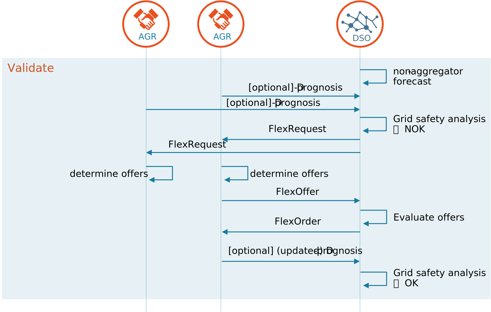
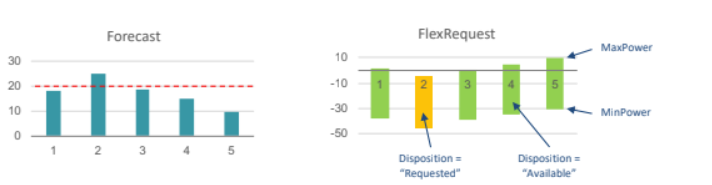
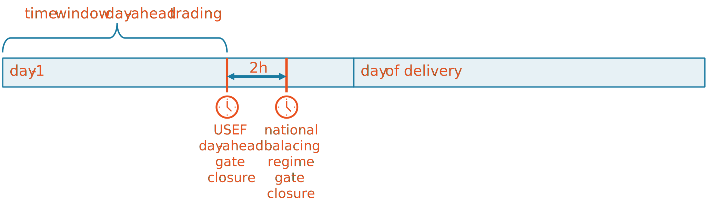
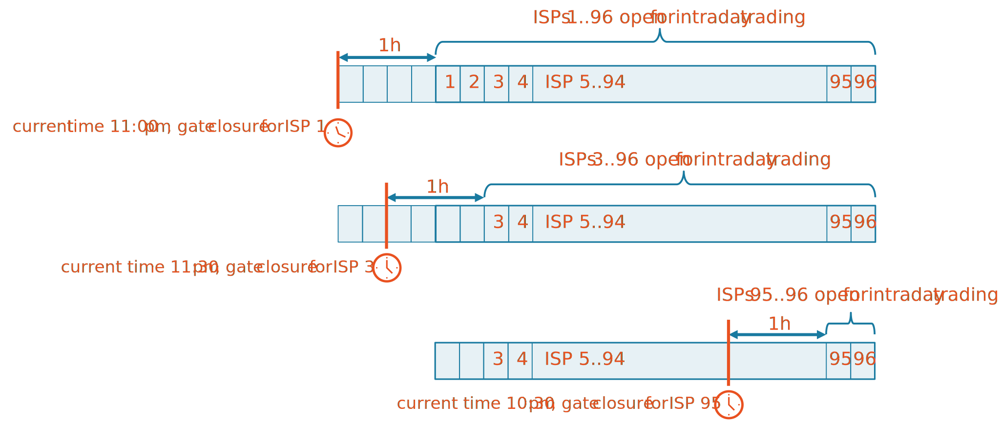

# Validate phase

## Overall description

<figure markdown>
  
  <figcaption>General information flow in Validate phase</figcaption>
</figure>

Assuming that D-prognoses are used as baseline4, each AGR creates a D-prognosis per declared congestion point and sends it to the DSO.
Sending D-prognoses is not required when an alternative baseline method has been agreed.
When all D-prognoses for a congestion point are received, the DSO combines these with the forecasts of non-AGR connections to execute a final grid safety analysis.
This analysis determines whether it is possible to distribute the planned energy, or the limits of the distribution grid are reached.
In the latter situation, USEF moves to the yellow regime and the DSO procures flexibility in the market to resolve these congestion issues.
The process of flexibility trading is as follows:

1. The DSO requests all AGRs at the congestion point to provide flexibility.
In this request, the DSO indicates the magnitude (amount of excess power) and timing (ISP) of the expected congestion, and how much capacity is available in the remaining ISPs. This is handled via a _FlexRequest_.
2. AGRs who are able and willing to change their load/generation profile in line with the request create _FlexOffers_.
3. If the offers are a good fit; i.e. help to mitigate congestion, the DSO can procure flexibility by placing a _FlexOrder_.
4. AGRs send an updated D-prognosis which incorporates the flexibility ordered.

If the flexibility offered is not sufficient to resolve the expected congestion, or no flexibility is offered, USEF moves to the orange regime.
Please note that in this situation, USEF specifies that the DSO procures all offered flexibility from the market (i.e. from the yellow regime) to solve parts of the congestion.
This is because any flexibility offered will still help to reduce the impact of the orange regime (e.g. the number of connections impacted by the graceful degradation).
USEF’s orange regime is outside the scope of UFTP, and, therefore, not further discussed in this document.

<figure markdown>
  
  <figcaption>AGR may send multiple FlexOffers on the same request, and open FlexOffers, which are not yet ordered may be revoked by the AGR.</figcaption>
</figure>

AGRs may respond with one or more FlexOffers.
Where an AGR responds with multiple FlexOffers, the DSO can freely choose the most appropriate offer(s).
Provided the flexibility has not been ordered via a FlexOrder, a FlexOffer may be revoked by the AGR (FlexOfferRevocation).

<figure markdown>
  
  <figcaption>Flexibility trading may go on until gate closure time. This includes iterations between plan phase and validate phase. The last accepted D-prognosis before gate closure time serves as a basis for the next phase. Any open FlexOffers, which are not expired, may be ordered after gate closure.</figcaption>
</figure>

## Exchange of D-prognoses between AGR and DSO

When using D-prognoses as the baseline methodology, an AGR sends its D-prognosis per congestion point to the DSO.
The DSO assesses the validity of each received D-prognosis and informs the AGR whether or not it is accepted.
As long as the gate closure time has not passed, the AGR can update its D-prognoses and resend it to the DSO.
During these iterations, an accepted D-prognosis5 is assumed actual, provided no associated updates are received and accepted by the DSO.

For the exchange of D-Prognoses, USEF specifies the following:

- An AGR is obliged to create a D-prognosis for its connections as soon as its connection point is declared by a DSO.
The AGR is informed of this congestion point via the mandatory (daily) CRO queries.
- The D-prognosis only includes the forecasted load of those prosumers served by the AGR and that have a connection related to a congestion point.
- The D-Prognosis contains one full calendar day for the day-ahead process.
In the intraday process, all remaining ISPs for that calendar day must be included
- The average power is given per ISP as a minimum time granularity
- The D-Prognosis does not include additional information; e.g. details about the available flexibility or prices

!!! success "USEF provides the following recommended practices for the exchange of D-Prognoses:"

    - The D-Prognosis is sent day-ahead to the DSO; at the latest, two hours before the gate closure of the national balancing regime (day-ahead gate closure) 6
    - The DSO can perform a monthly evaluation of the accuracy and reliability of D-prognoses in order to motivate AGRs to improve the D-prognoses they supply

## Processing D-prognoses

When all D-prognoses relating to a particular congestion point are received, the DSO creates a total prognosis for each congestion point.
When accumulating the D-prognoses, the DSO must estimate and add the distribution requirements required for those connections which are not served by an AGR, and, therefore, not included in the D-prognoses.
Using the accumulated D-prognosis, the DSO can determine whether it is possible to distribute the planned energy, or whether the limits of the distribution grid will be reached.

The timing of the FlexRequest is determined by the DSO, who must make a trade-off between waiting for all AGRs to send their D-prognoses7 before identifying grid constraints or issuing a FlexRequest based on its own grid forecasting process.
It is the DSO’s responsibility to combine the two sources of information.
Where alternative baseline methods are used, the DSO will issue a FlexRequest based solely on its own information.

The grid safety analysis can lead to either of the following conclusions:

- That no congestion is expected. All power flows are within calculated safety margins.
- That congestion is expected as the energy flows exceed calculated safety margins. The DSO then starts the process of acquiring flexibility from the market.

Where no AGRs are active at the congestion point, there is no market to supply the DSO with flexibility to reduce its energy flows to levels below the safety margins.
In this situation, the system moves to the orange regime.
The resulting DSO processes are outside the scope of this document.
See [4] for a global description.

## Flexibility trading between the AGR and DSO

If the outcome of the grid safety analysis is that congestion will arise, the system is moved to the yellow regime and the DSO will need to take action.
In order to solve the expected congestion, the following steps are taken:

1. The DSO requests all AGRs at the congestion point to provide flexibility.
In its request, the DSO indicates the magnitude (amount of excess power) and timing (ISP) of the expected congestion and (optionally) how much capacity is available in the remaining ISPs
2. The AGRs receive the flexibility request for adjusting8 distribution requirements
3. AGRs generate offers for the flexibility. Note that these offers could either be the result of a voluntary offering process or compulsory, where there are prearranged bilateral contracts between DSO and AGR (FlexOptions)
4. The DSO receives the flexibility offers
5. The DSO procures flexibility to resolve the congestion issues by placing flexibility orders.
6. The DSO determines whether the expected congestion is solved using the ordered flexibility.
If this is not the case, the system moves to the orange regime (see [4] for more details)
7. The AGRs receive the flexibility orders which result in the actual procurement of flexibility by the DSO.
8. AGRs provide an (updated) D-prognosis, incorporating the ordered flexibility.
This step only applies when D-prognoses are used as baseline methodology.

When trading via a market platform AGRs typically offer their flexibility without an underlying request (unsolicited flex offers) and the DSO selects appropriate offers.
Steps 1 and 2 are not applicable in this situation.

- Information about expected congestion is provided to all registered AGRs;
- Expected congestion information includes the direction of the overload (production/consumption);
- Expected congestion information includes the amount of reduction needed;
- Expected congestion information includes available grid capacity for other ISPs.

See appendix 2 for more details about this information exchange including rationale.

In the FlexRequest messages (see section 4.2.18), there is no single power value, rather a power space for each ISP, bound by two power values (“MinPower” and “MaxPower”).
In addition, there is a distinction between ISPs with a ‘requested’ disposition – meaning that there is a request for a deviation on the power consumption/production – and ISPs with an ‘available’ disposition – meaning that there is available space to deviate on the power consumption/production.

<figure markdown>
  
  <figcaption>Example forecast for a Congestion point, leading to an example FlexRequest, both displayed in graphs</figcaption>
</figure>

In the example used in Figure 2-8, congestion is expected at ISP 2 at a certain congestion point.
The FlexRequest is transmitted to all AGRs that have prosumers on the congestion point, requesting a decrease of consumption (or an increase of production) on ISP 2.
If AGRs choose to shift consumption from ISP 2 to another ISP, the available spaces in the ISPs from the FlexRequest indicate that there is more room for consumption in ISP 5 than in ISP 1, 3 and 4.
A flexibility offer with a consumption shift to ISP 5 is therefore more likely to be ordered.

Note that a request is always relative to the agreed baseline.
The essence of broadcasting the same request to all AGRs is that the requested deviation is the same for each AGR, relative to its own baseline.
Decreasing power consumption is thereby equivalent to increasing power production and vice versa.

The distribution of the FlexRequest message is limited to AGRs which are registered via the CRO (see Section 2.3).
The information on direction, amount and available capacity is provided in specific data structures that are part of the FlexRequest message (see Section 4.2.1).

For the procurement of flexibility by the DSOs, USEF specifies the following rules:

- A flexibility offer is valid until it expires or is revoked.
It is the AGRs responsibility to determine the acceptance deadline.
Revocation is not possible after the offer has been ordered.
- A flexibility order is definite and binding once it has been placed.
- The DSO chooses which flexibility offers it accepts to solve the congestion.
In this regard, it is not obligatory for the DSO to start with the offer that has the lowest price.
The DSO has the freedom to assess the balance between the price and quality9 of the flexibility offered in both long-term contracts and short-term offers.
- Bidding takes place at congestion point level, making every congestion point a local flexibility market.
- The DSO sends a flexibility request when the result of the grid safety analysis indicates possible congestion.
- A flexibility order is linked to a flexibility offer and a baseline for settlement purposes.

UFTP has two optional structures in the trading messages:

- [optional] A FlexOffer can contain multiple mutually exclusive options.
The DSO is able to pick one of the options in its FlexOrder.
Whether or not an AGR is allowed to add multiple options is signaled in the CRO.

- [optional] AGRs may indicate the capability for partial activation in their offers.
In all messages, a minimum activation percentage is provided i.e. all values lower than 100% mean that partial activation is possible.
The DSO could use partial activation to better match the requested flexibility with available offers.
Partial activation applies to all ISPs in the offer and also to the offered price.
For example, if the DSO procures 80% of the offer, all ISPs in the FlexOrder should be 80% of the corresponding ISPs in the FlexOffer, and the settlement price is set to 80% of the original price in the offer.
If the DSO has not implemented the option, it may simply ignore the structure.

### Updates after flex has been ordered

USEF specifies that when ISPs are altered as a result of a flexibility deal, the resulting load for these ISPs is used for settlement.
This means that deviation on ISPs with ‘requested’ disposition that have been traded, might lead to penalties for the associated AGR.
Updates on other ISPs are always possible for the AGR but will require a new D-prognosis.
Other AGRs can still change their D-prognoses for all ISPs without incurring a penalty.
More details about the penalty calculation can be found in the settlement Section 2.6.

The load profile resulting from a flexibility deal will be stored independently from any subsequent updates of the D-prognosis, because it allows the DSO to verify the actual delivery of the flexibility for settlement purposes.

!!! success "Recommended Practice for flexibility trading:"

    For the procurement of flexibility by the DSOs, USEF recommends the following:

    - Publishing is in an anonymized way
    - Pay-as-bid is used for pay-out.
    - Timing of the flexibility orders is between 24 and 2 hours before delivery (day-ahead trading).

## Iterations between the plan and validate phases

As a result of flexibility exchange with the DSO, the AGRs portfolio is not balanced and so it may wish to re-optimize it.
By doing so, the MCM returns to the plan phase (see Section 2.3), the only difference being that the AGR now takes the flexibility it has already sold into account.
In addition, during the plan phase, the AGR has the freedom to continuously re-optimize its portfolio whenever deemed necessary (e.g. when new and improved forecasts are available).
The rationale behind this high degree of freedom for the AGRs is to ensure that the flexibility they offer is applied in the most optimal and cost-effective way (i.e. flexibility is used there where it creates most value).

However, these iterative processes also lead to the issue that D-prognoses change continuously, and continuous alignment is required between AGR/DSO.
As a result, there is a risk that the iterative process between the plan and validate phases does not converge.
In conclusion, there is a balance to be struck between making sure that the iterative processes converge, and offering a high degree of freedom to ensure that the available flexibility is used in the most optimal and cost-effective way.

### Gate closure times

For reasons mentioned above, USEF specifies that there needs to be at least two moments in time when the iterations are forced to end. This moment is called the gate closure time.

In alignment with the current practices in liberalized energy markets, the two gate closure times are:

1. Day-ahead closure time: the moment at which the day-ahead market closes.
During the day-ahead period, the plan and validate phases can be iterated as often as needed, as long as the system converges before the gate closure time.
After the day-ahead closure time, the processes in the plan phase can only be restarted during the intraday period.

2. Intraday closure time10: the moment at which the intraday market closes.
During the intraday period, the plan and validate phases can be iterated as often as needed, as long as the system converges before the gate closure time.
After the intraday closure time, the processes in the plan phase cannot be restarted at all, as the MCM moves to the operate phase.

<figure markdown>
  
  <figcaption>Example of USEF day-ahead gate closure time.</figcaption>
</figure>

An example of the day-ahead gate closure is given in Figure 2-9 above.
Please note that while there is a single day-ahead gate closure time per day, there will be multiple intra-day gate closures.
This is illustrated in Figure 2-10.
The ISP corresponding to the current time is in operate phase and ISP’s more than one hour ahead are still in plan or validate phase.

<figure markdown>
  
  <figcaption>Example of USEF intra-day gate closure times.</figcaption>
</figure>

!!! success "Recommended Practice:"

    The national regulator determines the specific timing details of the gate closures. USEF recommends:

    - A day-ahead gate closure time of 2 hours before the gate closure of the national balancing market
    - An intraday gate closure time of one hour before the start of the ISP
