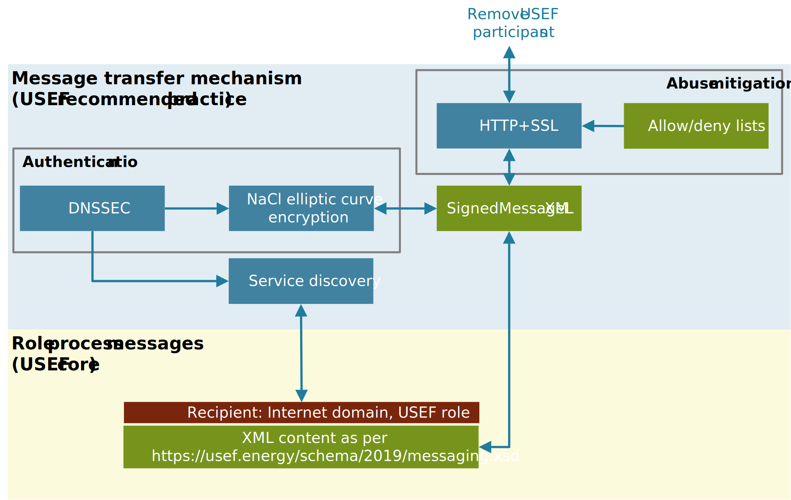

# Scope

USEF defines the content of XML messages between role processes, as required for implementation of USEF’s MCM.
Each message has a unique recipient, identified by the Internet domain and USEF role of the participant.
The message transfer mechanism is responsible for sending and receiving these messages.

<figure markdown>
  
  <figcaption>Relationship between the normative USEF XML messages (yellow pane) and the best-practice message transfer mechanism (light-blue pane).</figcaption>
</figure>

When selecting a message transfer mechanism, local market conditions should be considered and the USEF privacy and security guidelines should be followed [5].
Further recommendations about the message transport mechanism are given in Appendix 3.
