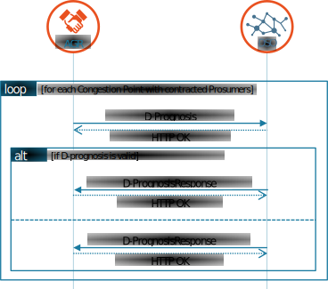
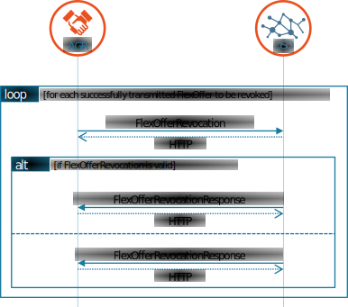

# Validate phase

In [Validate phase](../../general-description/validate-phase.md), informative description of the validate phase processes has been given. In this chapter the use cases will be described as derived from the validate phase.

The USEF MCM validate phase specifies the following use cases:

_Use cases for the Validate phase._

| Name                                                                                    | Direction | Message types                                     |
|-----------------------------------------------------------------------------------------|-----------|---------------------------------------------------|
| [Exchange D-Prognoses per Congestion Point](#exchange-d-prognoses-per-congestion-point) | AGR → DSO | Prognosis / PrognosisResponse                     |
| [Exchange Flexibility Requests](#exchange-flexibility-requests)                         | AGR ← DSO | FlexRequest / FlexRequestResponse                 |
| [Exchange Flexibility Offers](#exchange-flexibility-offers)                             | AGR → DSO | FlexOffer / FlexOfferResponse                     |
| [Revocation Flexibility Offer](#revocation-flexibility-offer)                           | AGR → DSO | FlexOfferRevocation / FlexOfferRevocationResponse |
| [Exchange Flexibility Orders](#exchange-flexibility-orders)                             | AGR ← DSO | FlexOrder / FlexOrderResponse                     |

The use cases are explained in the following sections.

## Exchange D-Prognoses per Congestion Point

<figure markdown>
  { width=1000px }
  <figcaption>Exchange of D-prognoses</figcaption>
</figure>

<table>
  <tr>
    <th></th>
    <th colspan="2">D-prognosis</th>
  </tr>
  <tr>
    <th>Goal in context</th>
    <td colspan="2">D-prognoses are (re)created by the AGR per congestion point, based on its portfolio. These D-prognoses will be submitted to the DSO. D-prognoses should be submitted at least once before the gate closure time. D-prognoses can be updated by transmitting a new one.</td>
  </tr>
  <tr>
    <th>Preconditions</th>
    <td colspan="2">Congestion point(s) defined and retrieved from the CRO, AGR per congestion point retrieved from CRO by DSO, AGR-DSO contracts in place.</td>
  </tr>
  <tr>
    <th>Successful outcome</th>
    <td colspan="2">D-prognosis message created and accepted by the DSO for each congestion point on which the AGR has active Connections</td>
  </tr>
  <tr>
    <th rowspan="6">Failure outcome</th>
    <th>RejectionReason</th>
    <th>Cause of rejection</th>
  </tr>
  <tr>
    <td>&lt;See Message validation&gt;</td>
    <td>D-prognosis failed to pass validation by the DSO</td>
  </tr>
  <tr>
    <td>Lacking ISPs</td>
    <td>The prognosis does not include all ISPs in the Period it applies to</td>
  </tr>
  <tr>
    <td>Power value rejection</td>
    <td>One or more Power values in the prognosis are not plausible</td>
  </tr>
  <tr>
    <td>Subordinate sequence number</td>
    <td>The message sequence is lower than that of a previously received D-prognosis</td>
  </tr>
  <tr>
    <td>[User defined]</td>
    <td>Any other reasonable cause to reject the message</td>
  </tr>
</table>

### Related information

Congestion points (with associated DSOs) at which the AGR has contracted prosumers, and active AGRs, are available via the common reference and should have been retrieved prior to executing this use case.

It is essential to use a sequence number that is incremented each time a new revision is sent so the order of transmission can be traced.

## Exchange Flexibility Requests

<figure markdown>
  { width=1000px }
  <figcaption>Exchange of FlexRequests</figcaption>
</figure>

<table>
  <tr>
    <th></th>
    <th colspan="2">FlexRequest</th>
  </tr>
  <tr>
    <th>Goal in context</th>
    <td colspan="2">If grid congestion is expected, requests for flexibility are created by the DSO and sent to AGRs potentially capable of helping to reduce that congestion. These requests serve as the basis for subsequent flexibility offers.</td>
  </tr>
  <tr>
    <th>Preconditions</th>
    <td colspan="2">AGR-DSO market contract in place. One or more Congestion Points registered in the Common Reference, with at least one AGR with contracted Connections on that point. DSO grid safety analysis performed.</td>
  </tr>
  <tr>
    <th>Successful outcome</th>
    <td colspan="2">Flexibility requests submitted to AGR(s)</td>
  </tr>
  <tr>
    <th rowspan="6">Failure outcome</th>
    <th>RejectionReason</th>
    <th>Cause of rejection</th>
  </tr>
  <tr>
    <td>&lt;See Message validation&gt;</td>
    <td>FlexRequest failed to pass validation by the AGR</td>
  </tr>
  <tr>
    <td>Lacking Requested Disposition</td>
    <td>The FlexRequest has no ISP with a “requested” disposition.</td>
  </tr>
  <tr>
    <td>Requested Power discrepancy</td>
    <td>One or more ISPs with a "requested" disposition has no direction: MinPower &lt; 0 and MaxPower &gt; 0.</td>
  </tr>
  <tr>
    <td>Power discrepancy</td>
    <td>One or more ISPs has a higher MinPower than MaxPower value.</td>
  </tr>
  <tr>
    <td>[User defined]</td>
    <td>Any other reasonable cause to reject the message</td>
  </tr>
</table>

### Related information

Each flexibility request should include the ISPs for which congestion is expected, including a direction (MinPower ≥ 0 or MaxPower ≤ 0), and it is advisable to send multiple ISPs for which capacity is still available, to allow AGRs to time-shift load.
For each period during which congestion is expected, the DSO may create any number of flexibility requests (including no requests at all).
If multiple requests are created, their content must not be identical.
Which variations (more/less requested power per ISP, time-shift of load) are created is a DSO-internal business decision.

## Exchange Flexibility Offers

<figure markdown>
  { width=1000px }
  <figcaption>Exchange of FlexOffers</figcaption>
</figure>

<table>
  <tr>
    <th></th>
    <th colspan="2">FlexOffer</th>
  </tr>
  <tr>
    <th>Goal in context</th>
    <td colspan="2">The AGR creates flexibility offers based on previous DSO flexibility requests and sends these to the originating DSOs. It is also possible to send FlexOffers that do not originate from a FlexRequest, which are called unsolicited FlexOffers. Each offer indicates to which extent the AGR can provide flexibility, what the effect on its baseline will be and what the price for the flexibility would be.</td>
  </tr>
  <tr>
    <th>Preconditions</th>
    <td colspan="2">AGR-DSO market contract in place. AGR has at least one contracted Connection on the Congestion point. Flexibility offers can be based on previous flexibility requests that have been accepted and stored, or be initiated without a preliminary flex request (called an unsolicited flex offer).</td>
  </tr>
  <tr>
    <th>Successful outcome</th>
    <td colspan="2">Flexibility offers sent to the DSO</td>
  </tr>
  <tr>
    <th rowspan="6">Failure outcome</th>
    <th>RejectionReason</th>
    <th>Cause of rejection</th>
  </tr>
  <tr>
    <td>&lt;See Message validation&gt;</td>
    <td>FlexOffer failed to pass validation by the DSO</td>
  </tr>
  <tr>
    <td>No baseline</td>
    <td>The AGR has no valid baseline, possibly lacking a valid D-prognosis</td>
  </tr>
  <tr>
    <td>Power value rejection</td>
    <td>One or more Power values in the FlexOffer are not plausible</td>
  </tr>
  <tr>
    <td>Request mismatch</td>
    <td>None of the ISPs with a "requested" disposition in the referred FlexRequest, is mentioned in the FlexOffer</td>
  </tr>
  <tr>
    <td>No MutEx offer support</td>
    <td>The FlexOffer contains mutual exclusive offers (OfferOptions), which is not supported by the DSO</td>
  </tr>
  <tr>
    <td>[User defined]</td>
    <td>Any other reasonable cause to reject the message</td>
  </tr>
</table>

### Related information

- USEF does not specify how the AGR determines the optimal flexibility offer, offer price or optimal timing to send the offer to the DSO.
- AGRs may choose to send multiple FlexOffer messages: this includes sending a FlexOffer that better meets the DSO request at a much later time when circumstances have changed.
Unsolicited FlexOffers are also allowed, in which case the FlexRequestOrigin and FlexRequestSequence fields are empty.
- Sending a FlexOffer for partial activation is always allowed, although it is ignored by the DSO if it does not support partial activation (in which case the MinActivationFactor is always 1).

Note that acceptance of the FlexOffer message does not imply ordering of the flexibility.

## Revocation Flexibility Offer

<figure markdown>
  { width=1000px }
  <figcaption>Revocation of FlexOffer</figcaption>
</figure>

<table>
  <tr>
    <th></th>
    <th colspan="2">Revoke FlexOffer</th>
  </tr>
  <tr>
    <th>Goal in context</th>
    <td colspan="2">When a previously sent flexibility offer is no longer valid, despite the validity period of the offer not having expired yet, the AGR informs the DSO that the offer is revoked. After revocation, the DSO cannot order the flexibility from this offer anymore.</td>
  </tr>
  <tr>
    <th>Preconditions</th>
    <td colspan="2">The concerning flexibility offer has been sent to and acknowledged by the DSO, and has not (yet) been procured using a FlexOrder</td>
  </tr>
  <tr>
    <th>Successful outcome</th>
    <td colspan="2">Flexibility offer revocation notification submitted to the DSO</td>
  </tr>
  <tr>
    <th rowspan="6">Failure outcome</th>
    <th>RejectionReason</th>
    <th>Cause of rejection</th>
  </tr>
  <tr>
    <td>&lt;See Message validation&gt;</td>
    <td>FlexOfferRevocation failed to pass validation by the DSO</td>
  </tr>
  <tr>
    <td>Flexibility procured</td>
    <td>The FlexOffer cannot be revoked because its flexibility has already been ordered</td>
  </tr>
  <tr>
    <td>[User defined]</td>
    <td>Any other reasonable cause to reject the message</td>
  </tr>
</table>

### Related information

Only flexibility offers communicated using a FlexOffer message which has already been acknowledged by the DSO can be revoked.
If the acknowledgement is still pending, the AGR should delay sending its FlexOfferRevocation message until the acknowledgement has been received.
When the DSO receives a revocation of a flexibility offer it wants to order, this is not a valid base to reject the revocation.
After revocation, the offer can no longer be ordered.

FlexOffers may be revoked at any time in the plan and validate phases (and also in operate phase as described in [Revocation Flexibility Offer](operate-phase.md#revocation-flexibility-offer)), unless there is already a FlexOrder based on the offer.
Notice that FlexOrders and FlexOfferRevocations can cross each other.
Where this is the case, priority should be given to the FlexOfferRevocation.

## Exchange Flexibility Orders

<figure markdown>
  { width=1000px }
  <figcaption>Exchange of FlexOrder</figcaption>
</figure>

<table>
  <tr>
    <th></th>
    <th colspan="2">FlexOrder</th>
  </tr>
  <tr>
    <th>Goal in context</th>
    <td colspan="2">Process for the DSO to accept (some) flexibility offers to solve Congestion based on the Prognosis.</td>
  </tr>
  <tr>
    <th>Preconditions</th>
    <td colspan="2">Corresponding FlexOffer has been received and accepted by DSO and is still valid.</td>
  </tr>
  <tr>
    <th>Successful outcome</th>
    <td colspan="2">Flexibility procured</td>
  </tr>
  <tr>
    <th rowspan="6">Failure outcome</th>
    <th>RejectionReason</th>
    <th>Cause of rejection</th>
  </tr>
  <tr>
    <td>&lt;See Message validation&gt;</td>
    <td>FlexOrder failed to pass validation by the AGR</td>
  </tr>
  <tr>
    <td>ISP mismatch</td>
    <td>ISPs from the FlexOrder do not match the ISPs given in the FlexOffer</td>
  </tr>
  <tr>
    <td>Power mismatch</td>
    <td>Ordered flexibility does not match the offered flexibility</td>
  </tr>
  <tr>
    <td>Price mismatch</td>
    <td>Price in the order does not match the price given in the offer</td>
  </tr>
  <tr>
    <td>[User defined]</td>
    <td>Any other reasonable cause to reject the message</td>
  </tr>
</table>

### Related information

The DSO needs to make its own decisions about which FlexOffers to accept.
FlexOffers can only be ordered once and have to be ordered as specified in the corresponding offer for the specified price.
Only in situations where partial activation is supported and offered in the FlexOffer can the ISP power and price be altered to conform to the specifications from Section [Flexibility trading between the AGR and DSO](../../general-description/validate-phase.md#flexibility-trading-between-the-agr-and-dso).
After a successful FlexOrder transmission, the AGR is responsible for providing the ordered flexibility via an updated D-prognosis which reflects the traded flexibility.
